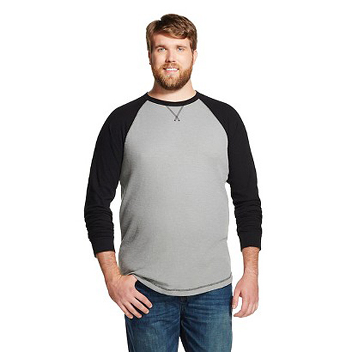

# PTSD Symptoms in Fathers After Child Birth (DRAFT)

## Data Load and Background

The `maleptsd.csv` file on our web site contains information on PTSD (post traumatic stress disorder) symptoms following childbirth for 64 fathers[^1].  There are ten predictor variables and the response is a measure of PTSD symptoms. The raw, untransformed values (`ptsd.raw`) are right skewed and contain zeros, so we will work with a transformation, specifically, `ptsd = log(ptsd.raw + 1)` as our outcome, which also contains a lot of zeros. 

```{r load data, message = FALSE}
maleptsd <- maleptsd %>%
    mutate(ptsd = log(ptsd.raw + 1))

maleptsd
```

Each of the variables in the data set (except the subject ID code) is imported into R here as a double-precision numeric variable.

## Transformation of our Outcome

As noted, we transformed our outcome from `ptsd.raw` to `ptsd`. Consider the shape of the histograms below.

```{r}
p1 <- ggplot(maleptsd, aes(x = ptsd.raw)) +
    geom_histogram(bins = 9, fill = "red", col = "white") +
    labs(title = "Original PTSD scores")

p2 <- ggplot(maleptsd, aes(x = ptsd)) +
    geom_histogram(bins = 9, fill = "blue", col = "white") +
    labs(title = "After Transformation")

gridExtra::grid.arrange(p1, p2, nrow = 1)
```

## Scatterplot Matrix

Using the `ggpairs` function from the `GGally` package, we have...

```{r, fig.height = 7, cache = TRUE}
GGally::ggpairs(select(maleptsd, -c(id, ptsd.raw)))
```

## Kitchen Sink Model: PTSD

With 64 observations, a kitchen sink model with 10 predictors (not counting the intercept) is clearly overfit[^2], but we'll take a look at collinearity and some related issues first using that model.

```{r}
m_ks <- lm(ptsd ~ over2 + over3 + over5 + bond + posit + 
               neg + contr + sup + cons + aff, 
           data=maleptsd)

vif(m_ks)
```

There are several different `vif` calculators we have enabled, including ones within the `faraway`, `rms` and `car` packages.

# Best Subsets for PTSD

Following the approach of Wright and London[^3], I will create a `preds` object with the names of the predictors so I don't have to retype them again.

```{r best subsets maleptsd}
preds <- with(maleptsd, cbind(over2, over3, over5, 
          bond, posit, neg, contr, sup, cons, aff))
x1 <- regsubsets(preds, maleptsd$ptsd, nvmax=10)
rs <- summary(x1)
rs
```

Note that these models are *not* built in a stepwise fashion. For example, the `aff` variable appears in models containing 2-7 (non-intercept) predictors, but then does not appear again until the model with all 10 of our candidate predictors.

## Identifying Candidate Models via Summary Statistics

### Which model has the highest adjusted R^2^?

We'll start by tabulating the results for Adjusted R^2^ for each of the 10 models identified in our `rs` materials. We'll index the models by p, which is the number of inputs to the model, including the intercept. 

```{r best model by adj r-square}
temp <- data.frame(p = 2:11, adjr2 = round(rs$adjr2, 3))
t(temp)
```

Note that I have tabulated the results into a data frame, and then transpose the rows and columns with the `t` function before printing, so that I get a row for each summary statistic, rather than a column.

And now, which predictors are included in the model with the largest value of adjusted R^2^?

```{r}
rs$which[which.max(rs$adjr2),]
```

It looks like the model with p = 7 (so six non-intercept predictors) will have the largest adjusted R^2 value. That model includes `over2`, `over3`, `bond`, `neg`, `sup` and `aff` and its adjusted R^2^ value  turns out to be `r round(max(rs$adjr2),3)`.

### Which model has the smallest BIC?

```{r best model by bic}
temp$bic <- round(rs$bic, 2)
temp
```

And so, which predictors are included in the model with smallest BIC?

```{r}
rs$which[which.min(rs$bic),]
```

The model with just two non-intercept predictors: `neg` and `aff` has the smallest BIC, at `r round(min(rs$bic),2)`.

### Calculating Bias-Corrected AIC, from Hurwitz and Tsai

To calculate bias-corrected AIC, we need the sample size, *n* = 64, and we need to know the number of coefficients (predictors, including the intercept) in each of the models we fit, which will be 2:11, since we fit models with 1:10 non-intercept predictors. The resulting calculation is:

```{r}
rs$aic.corr <- 64*log(rs$rss / 64) + 2*(2:11) +
               (2 * (2:11) * ((2:11)+1) / (64 - (2:11) - 1))
temp$aic.corr <- round(rs$aic.corr,2)
temp
```

And so, which predictors are in the best model by corrected AIC?

```{r}
rs$which[which.min(rs$aic.corr),]
```

The model with two non-intercept predictors, specifically, `neg` and `aff`, also appears to be the choice of bias-corrected AIC.

### Mallows' C~p~

We can obtain the C~p~ statistics, as we've done for other measures, with:

```{r}
round(rs$cp,3)
```

We can tabulate the results, too. The `difference` variable here is just $C_p - p$.

```{r}
temp$Cp <- round(rs$cp, 1)
temp$delta <- round(rs$cp, 1) - 2:11
temp
```

Recall that the full model (p = 11) will inevitably have C~p~ = p, but what we're looking for is a model with C_p near p, for as small as p as possible. 

```{r}
rs$which[3,]
```

It looks like the model with p = 3 might be the best choice, which again is the model with `neg` and `aff`, but I usually make this decision with the aid of a C~p~ plot.

## Building the Four Summary Plots

```{r best subsets for male PTSD, fig.width=8, fig.height=8}
# Note: 64 subjects, models for 1-10 predictors (2-11 coeffs.)

par(mfrow=c(2,2))

# Adjusted R-squared Plot
m2 <- max(rs$adjr2)
m1 <- which.max(rs$adjr2)
plot(rs$adjr2 ~ I(2:11), ylab="Adjusted R-squared", 
     xlab="# of Fitted Coefficients, with Intercept",
     main="Adjusted R-Squared")
lines(spline(rs$adjr2 ~ I(2:11)))
arrows(m1+1, m2-0.02, m1+1, m2)
text(m1+1, m2-0.03, paste("max =", format(m2, digits=3)))
text(m1+1, m2-0.045, paste("with", format(m1+1, digits=1), 
                        "coeffs."), pos=3)

# Cp Plot
plot(rs$cp ~ I(2:11), 
     ylab="Cp Statistic", 
     xlab="p = # of Fitted Coefficients", 
     pch=16, main="Cp")
abline(0,1)

# Next calculate bias-corrected AIC
# recall n = 64, and we have 10 models
# so that's 2-11 coefficients to fit

rs$aic.corr <- 64*log(rs$rss / 64) + 2*(2:11) +
               (2 * (2:11) * ((2:11)+1) / (64 - (2:11) - 1))

# Bias-Corrected AIC plot with arrow included
# to indicate minimum AIC-corrected
m2 <- min(rs$aic.corr)
m1 <- which.min(rs$aic.corr)
plot(rs$aic.corr ~ I(2:11), ylab="Bias-Corrected AIC", 
     xlab="# of Fitted Coefficients", pch=16, cex=1.5, 
     col="tomato", main="Bias-Corrected AIC")
arrows(m1+1, m2+3, m1+1, m2+1)

# plot BIC with indicating arrow for minimizer
m2 <- min(rs$bic)
m1 <- which.min(rs$bic)
plot(rs$bic ~ I(2:11), ylab="BIC", xlab="# of Fitted Coefficients", 
     pch=16, cex=1.5, col="slateblue", main="BIC")
arrows(m1+1, m2+4, m1+1, m2+1)

par(mfrow=c(1,1))
```

## The Candidate Models

Summary | p | Suggested Predictors
-----------------------: | ---: | ---------------------------
C~p~, bias-corrected AIC, BIC | 3 | `neg` and `aff`
Adjusted R^2^ | 7 | `neg`, `aff` and `over2`, `over3`, `bond`, `sup`

## Comparing Candidate Models via ANOVA

Let's fit the four models of interest here using `lm`, including:

- Model `m.ks`, the kitchen sink model which includes all candidate predictors
- Model `m7` which includes `neg`, `aff`, `over2`, `over3`, `bond` and `sup` 
- Model `m3`, which includes `neg` and `aff` 
- Model `m.null`, the null model with intercept only

```{r}
m.ks <- lm(ptsd ~ over2 + over3 + over5 + bond + 
                 posit + neg + contr + sup + cons + aff,
               data=maleptsd)
m7 <- lm(ptsd ~ neg + aff + over2 + over3 + bond + sup,
            data=maleptsd)
m3 <- lm(ptsd ~ neg + aff, data=maleptsd)
m.null <- lm(ptsd ~ 1, data = maleptsd)
anova(m.ks, m7, m3, m.null)
```

What tests do these *p* values contained in the `Pr(>F)` column speak to?

## Model 3, the apparent "winner"

```{r}
display(m3)
```

### Residual Plots

```{r}
par(mfrow = c(2,2))
plot(m3)
par(mfrow = c(1,1))
```

## Alternative Strategies for Identifying Candidate Models using `regsubsets`

The `regsubsets` approach lets us tweak our strategies for identifying good models. 

Suppose that (for some reason) we wanted to 

- force `posit` and `neg` into the model, and 
- investigate the **two** best models at each predictor count, and 
- to investigate models that used **up to five** of the available ten predictors.

The resulting code is:

```{r building x2}
x2 <- regsubsets(ptsd ~ posit + neg + over2 + over3 + over5 + 
                     bond + contr + sup + cons + aff, data=maleptsd, 
                 force.in=c("posit","neg"), 
                 nbest=2, nvmax=5)
rs2 <- summary(x2)
rs2
```

Working within these constraints, `regsubsets` identifies, for example, the models with:

- `posit`, `neg`, `sup` and `aff`, and
- `posit`, `neg`, `bond` and `aff` 

as the two most promising subsets of exactly four predictors drawn from the original set of 10.

### Plotting the results (multiple subsets for each predictor count)

Each plot below uses a filled blue circle (pch = 19, col blue) to identify the "best" model - labeled (1) in the summary of the regression subsets object, and an open red circle (pch = 1, col red) to identify the "second best" model - labeled (2) in the summary, with that number of predictors. 

Notice the use of `rep(4:6, each = 2)` to produce the parameter counts (4, 4, 5, 5, 6, 6) [adding in the intercept term] that I need in each plot.

```{r my plot for x2, fig.height=7}
par(mfrow=c(2,2))

## Plot 1 - adjusted R-squared with best model identified
plot(rs2$adjr2 ~ rep(4:6, each=2), pch=c(19,1), 
     col=c("blue", "red"), ylab="Adjusted R-squared", 
     xlab="# of Parameters", cex=1.5, main="Adj R-sq (Top 2 Models)")

## Plot 2 - Cp Plot
plot(rs2$cp ~ rep(4:6, each=2), pch=c(19,1), 
     col=c("blue", "red"), ylab="Cp", xlab="# of Parameters", 
     cex=1.5, main="Cp Plot (Top 2 Models)")
abline(0,1)

## Plot 3 Bias-Corrected AIC Plot
rs2$aic.corr <- 64*log(rs2$rss / 64) + (rep(4:6, each=2))*2 +
               (2 * rep(4:6, each=2) * (rep(4:6, each=2)+1) / (64 - rep(4:6, each=2) - 1))


plot(rs2$aic.corr ~ rep(4:6, each=2), pch=c(19,1), 
     col=c("blue", "red"), ylab="AIC", 
     xlab="# of Parameters", cex=1.5, main="Bias-Corrected AIC (Top 2 Models)")

## Plot 4 BIC Plot
plot(rs2$bic ~ rep(4:6, each=2), pch=c(19,1), col=c("blue", "red"), 
     ylab="BIC", xlab="# of Parameters", cex=1.5, 
     main="BIC (Top 2 Models)")

par(mfrow=c(1,1))
```

Within each vertical stripe in each plot, then, blue beats red, sometimes by a little, sometimes a lot.

## How Big Should Our Models Be?



So, what **should** we be thinking about when confronted with a situation where a new model is under development, and we have some data and a lot of predictors to consider?

Harrell, quoting LJ Savage: "As big as an elephant." (the *anti-parsimony* principle)

- There is no guarantee that a stepwise model will be correct, or that you will be able to evaluate it appropriately. 
- For building clinical prediction models, Harrell strongly recommends the use of subject matter knowledge over automated statistical
decision-making. 
- "An honest uncertainty assessment requires parameters for all effects that we know may be present."

Occam's Razor - a useful problem-solving principle...

> Among competing hypotheses, the one with the fewest assumptions should be selected.

> Everything should be made as simple as possible, but not simpler.

- aphorism often attributed to A. Einstein

> Now that data has grown to become "big data" and the complexity of the inference is also bigger, should our models grow? 

- Big Data in Biomedicine conference, Warwick UK 2014

### Sander Greenland's comments on parsimony and stepwise approaches to model selection

- Stepwise variable selection on confounders leaves important confounders uncontrolled.
- Shrinkage approaches (like ridge regression and the lasso) are far superior to variable selection.
- Variable selection does more damage to confidence interval widths than to point estimates.

If we are seriously concerned about **overfitting** - winding up with a model that doesn't perform well on new data - then stepwise approaches generally don't help.

### Why not use stepwise procedures?

1. The R^2^ for a model selected in a stepwise manner is biased, high.
2. The coefficient estimates and standard errors are biased.
3. The $p$ values for the individual-variable t tests are too small.
4. In stepwise analyses of prediction models, the final model represented noise 20-74\% of the time.
5. In stepwise analyses, the final model usually contained less than half of the actual number of real predictors.
6. It is not logical that a population regression coefficient would be exactly zero just because its estimate was not statistically significant.

This last comment applies to things like our "best subsets" approach as well as standard stepwise procedures.

### Vittinghoff's four strategies for minimizing the chance of overfitting

1. Pre-specify well-motivated predictors and how to model them.
2. Eliminate predictors without using the outcome.
3. Use the outcome, but cross-validate the target measure of prediction error.
4. Use the outcome, and **shrink** the coefficient estimates.

### Attacking a flaw of "Best Subsets" or Stepwise Approaches

The best subsets methods we have studied either include a variable or drop it from the model. 

Often, this choice is based on only a tiny difference in the quality of a fit to data. 

- Harrell: not reasonable to assume that a population regression coefficient would be exactly zero just because it failed to meet a criterion for significance. 
- Efron: this approach is "overly greedy, impulsively eliminating covariates which are correlated with other covariates."

So, what's the alternative?

## Ridge Regression

**Ridge regression** involves a more smooth transition between useful and not useful predictors which can be obtained by constraining the overall size of the regression coefficients.

Ridge regression assumes that the regression coefficients (after normalization) should not be very large. This is reasonable to assume when you have lots of predictors and you believe *many* of them have some effect on the outcome.

Pros:

1. Some nice statistical properties
2. Can be calculated using only standard least squares approaches, so it's been around for a while.
3. Available in the `MASS` package.


Ridge regression takes the sum of the squared estimated standardized regression coefficients and constrains that sum to only be as large as some value $k$.

\[
\sum \hat{\beta_j}^2 \leq k.
\]

The value $k$ is one of several available measures of the amount of shrinkage, but the main one used in the `MASS` package is a value $\lambda$. As $\lambda$ increases, the amount of shrinkage goes up, and $k$ goes down.

## Assessing a Ridge Regression Approach

We'll look at a plot produced by the `lm.ridge` function for a ridge regression for the Male PTSD study.

- Several (here 101) different values for $\lambda$, our shrinkage parameter, will be tested.
- Results are plotted so that we see the coefficients across the various (standardized) predictors.
    + Each selection of a $\lambda$ value implies a different vector of covariate values across the predictors we are studying.
    + The idea is to pick a value of $\lambda$ for which the coefficients seem relatively stable.

```{r ridge for ptsdmale code}
preds <- with(maleptsd, cbind(over2, over3, over5, bond, 
                              posit, neg, contr, sup, 
                              cons, aff))
### requires MASS package
x <- lm.ridge(maleptsd$ptsd~preds, lambda=seq(0, 100, by=1))
plot(x)
title("Ridge Regression")
abline(h=0)
```

Usually, you need to use trial and error to decide the range of $\lambda$ to be tested. Here, `seq(0, 100, by=1)` means going from 0 (no shrinkage) to 100 in steps of 1.

### The `lm.ridge` plot - where do coefficients stabilize?

Does $\lambda = 50$ seem like a stable spot here?

```{r ridge for ptsdmale with 50 line}
x <- lm.ridge(maleptsd$ptsd~preds, lambda=seq(0, 100, by=1))
plot(x)
title("Ridge Regression")
abline(h=0)
abline(v=50, lty=2, col="black")
```

The coefficients at $\lambda$ = 50 can be determined from the `lm.ridge` output. These are fully standardized coefficients. The original predictors are centered by their means and then scaled by their standard deviations and the outcome has also been centered, in these models.

```{r coeffs at lambda 50}
round(x$coef[,50],3)
```

Was an intercept used?

```{r intercept at lambda 50}
x$Inter
```

There is an automated way to pick $\lambda$. Use the `select` function in the `MASS` package:

```{r select lambda}
MASS::select(x)
```

I'll use the GCV = generalized cross-validation to select $\lambda$ = 40 instead.

```{r ridge for ptsdmale with 40 line}
x <- lm.ridge(maleptsd$ptsd~preds, lambda=seq(0, 100, by=1))
plot(x)
title("Ridge Regression")
abline(h=0)
abline(v=40, lty=2, col="black")

x$coef[,40]
```

## Ridge Regression: The Bottom Line

The main problem with ridge regression is that all it does is shrink the coefficient estimates, but it's not so useful in practical settings because it still includes all variables.

1. It's been easy to do ridge regression for many years, so you see it occasionally in the literature.
2. It leads to the **lasso**, which incorporates the positive features of shrinking regression coefficients with the ability to wisely select some variables to be eliminated from the predictor pool.


## The Lasso

The lasso works by takes the sum of the absolute values of the estimated standardized regression coefficients and constrains it to only be as large as some value k.

\[
\sum \hat{|\beta_j|} \leq k.
\]

This looks like a minor change, but it's not.

## Consequences of the Lasso Approach

1. In ridge regression, while the individual coefficients shrink and sometimes approach zero, they seldom reach zero and are thus excluded from the model. With the lasso, some coefficients do reach zero and thus, those predictors do drop out of the model. 
    + So the lasso leads to more parsimonious models than does ridge regression. 
    + Ridge regression is a method of shrinkage but not model selection. The lasso accomplishes both tasks.
2. If k is chosen to be too small, then the model may not capture important characteristics of the data. If k is too large, the model may over-fit the data in the sample and thus not represent the population of interest accurately.
3. The lasso is far more difficult computationally than ridge regression (the problem requires an algorithm called least angle regression published in 2004), although R has a package (`lars`) which can do the calculations pretty efficiently.

The lasso is not an acronym, but rather refers to cowboys using a rope to pull cattle from the herd, much as we will pull predictors from a model.

## How The Lasso Works

The `lars` package lets us compute the lasso coefficient estimates **and** do cross-validation to determine the appropriate amount of shrinkage. The main tool is a pair of graphs.

1. The first plot shows what coefficients get selected as we move from constraining all of the coefficients to zero (complete shrinkage) towards fewer constraints all the way up to ordinary least squares, showing which variables are included in the model at each point.
2. The second plot suggests where on the first plot we should look for a good model choice, according to a cross-validation approach.

```{r lasso graph 1 for maleptsd}
## requires lars package
lasso1 <- lars(preds, maleptsd$ptsd, type="lasso")
plot(lasso1)
```

- The y axis shows standardized regression coefficients. 
    + The `lars` package standardizes all variables so the shrinkage doesn't penalize some coefficients because of their scale. 
- The x-axis is labeled `|beta|/max|beta|`. 
    + This ranges from 0 to 1.
    + 0 means that the sum of the $|\hat{\beta_j}|$ is zero (completely shrunk)
    + 1 means the ordinary least squares unbiased estimates.
    
The lasso graph starts at constraining all of the coefficients to zero, and then moves toward ordinary least squares. 

Identifiers for the predictors (numbers) are shown to the right of the graph.

The vertical lines in the lasso plot show when a variable has been eliminated from the model, and in fact these are the only points that are actually shown in the default lasso graph. The labels on the top of the graph tell you how many predictors are in the model at that stage.

```{r summary of lasso 1}
summary(lasso1)
```

## Cross-Validation with the Lasso

Normally, cross-validation methods are used to determine how much shrinkage should be used. We'll use the `cv.lars` function.

- 10-fold (K = 10) cross-validation
    + the data are randomly divided into 10 groups. 
    + Nine groups are used to predict the remaining group for each group in turn.
    + Overall prediction performance is computed, and the machine calculates a cross-validation criterion (mean squared error) and standard error for that criterion.
    
The cross-validation plot is the second lasso plot.

```{r lasso graph 2}
set.seed(432432)
lassocv <- cv.lars(preds, maleptsd$ptsd, K=10)
## default cv.lars K is 10
```

We're looking to minimize cross-validated mean squared error in this plot: something that happens around a fraction of 0.3

## What value of the key fraction minimizes cross-validated MSE?

```{r lasso frac calculation}
frac <- lassocv$index[which.min(lassocv$cv)]
frac
```

The cross-validation plot suggests we use a fraction of about 0.3, that's suggesting a model with 4-5 predictors, based on the top LASSO plot.

```{r code for both plots together lasso, fig.height=7}
par(mfrow=c(2,1))
lasso1 <- lars(preds, maleptsd$ptsd, type="lasso")
plot(lasso1)
set.seed(432432)
lassocv <- cv.lars(preds, maleptsd$ptsd, K=10)
par(mfrow=c(1,1))
```

## Coefficients for the Model Identified by the Cross-Validation

```{r coef of cv choice}
coef.cv <- coef(lasso1, s=frac, mode="fraction")
round(coef.cv,4)
```

So the model suggested by the lasso\footnote{Note that our "best subsets" model with five predictors used the same five predictors.} includes `over3`, `bond`, `neg`, `sup` and `aff`.

To make a fair comparison between the (shrunken) Lasso coefficients and (unshrunken) OLS, we'd need **standardized coefficients** from the OLS model, for instance, with the help of the `QuantPsyc` package.

```{r standardized lm coefficients, message=FALSE}
lm1 <- lm(ptsd ~ over3 + bond + neg + sup + aff, 
          data=maleptsd)
## lm.beta is part of the QuantPsyc package
round(QuantPsyc::lm.beta(lm1),4)
```

Lasso Coefficients not equal to zero:
```{r lasso coeff}
round(coef.cv[coef.cv != 0], 4)
```

## Obtaining Fitted Values from Lasso

```{r fitted lasso values}
fits.cv <- predict.lars(lasso1, preds, s=frac, 
                        type="fit", mode="fraction")
fits.cv
```

### Complete Set of 64 Fitted Values from the Lasso

```{r fitted lasso values completed}
round(fits.cv$fit,3)
```

## When is the Lasso Most Useful?

As Faraway suggests, the lasso is particularly useful when we believe the effects are sparse, in the sense that we believe that few of the many predictors we are evaluating have a meaningful effect. 

Consider, for instance, the analysis of gene expression data, where we have good reason to believe that only a small number of genes have an influence on our response of interest.

Or, in medical claims data, where we can have thousands of available codes to search through that may apply to some of the people included in a large analysis relating health care costs to outcomes.


---

*Footnotes below*.

[^1]: Original Source: Ayers et al. 2007 *J Reproductive and Infant Psychology*. The data are described in more detail in Wright DB and London K (2009) *Modern Regression Techniques Using R* Sage Publications.

[^2]: Remember that with *n* = 64 observations, we are unlikely to be able to justify more than n/15 or about 4 predictors, including the intercept term, in a model we want to use for prediction of new data, or explanation of the relative importance of candidate predictors.

[^3]: Wright DB and London K (2009) *Modern Regression Techniques Using R* Sage Publications.